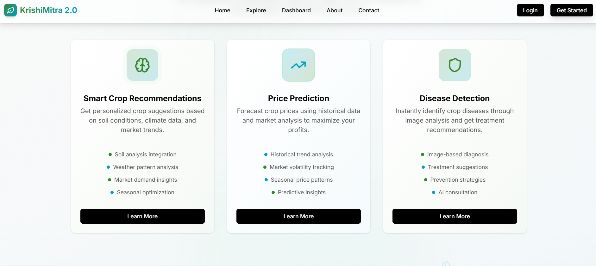
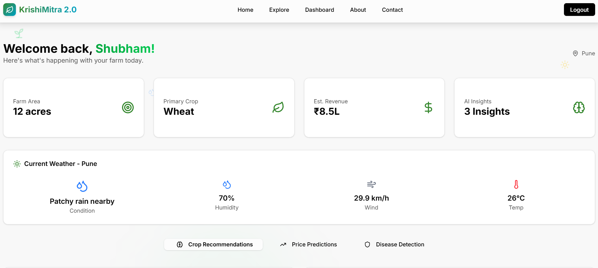

# KrishiMitra 2.0

[](https://dc-pearl.vercel.app/)

[](https://dc-pearl.vercel.app/)

## 🖼️ Prototype Screenshots

<table>
  <tr>
    <td align="center">
      
      <br/>
      <b>Homepage View</b>
    </td>
    <td align="center">
      
      <br/>
      <b>Dashboard View</b>
    </td>
  </tr>
</table>

## Description

KrishiMitra 2.0 is an advanced AI-powered agricultural platform designed to help farmers make data-driven decisions. The application leverages artificial intelligence to provide personalized crop recommendations, accurate price predictions, and instant disease detection capabilities.

The platform combines decades of agricultural research with advanced machine learning algorithms to offer:

- **Crop Recommendations**: Get personalized suggestions based on soil conditions, weather patterns, and regional data
- **Price Predictions**: Forecast crop prices up to 6 months ahead with 85% accuracy
- **Disease Detection**: Instantly identify crop diseases through image analysis
- **Weather Monitoring**: Access real-time weather data for informed farming decisions

Our mission is to bridge the gap between traditional farming wisdom and cutting-edge artificial intelligence, making advanced agricultural insights accessible to all farmers regardless of their scale or location.

## Installation

### Prerequisites

- Node.js (v18 or higher)
- npm or pnpm
- Supabase account for database services
- API keys for weather and AI services

### Setup Instructions

1. Clone the repository:
   ```bash
   git clone https://github.com/yourusername/krishimitra-2.0.git
   cd krishimitra-2.0
   ```

2. Install dependencies:
   ```bash
   npm install
   # or
   pnpm install
   ```

3. Create a `.env.local` file in the root directory with the following variables:
   ```
   # Supabase Configuration
   NEXT_PUBLIC_SUPABASE_URL=your_supabase_url
   NEXT_PUBLIC_SUPABASE_ANON_KEY=your_supabase_anon_key
   
   # Weather API Configuration
   WEATHER_API_KEY=your_weather_api_key
   WEATHER_API_HOST=your_weather_api_host
   
   # AI Services
   A4F_API_KEY=your_a4f_api_key
   A4F_BASE_URL=your_a4f_base_url
   ```

4. Run the development server:
   ```bash
   npm run dev
   # or
   pnpm dev
   ```

5. Open [http://localhost:3000](http://localhost:3000) in your browser to see the application.

## Usage Guide

### Dashboard

The dashboard provides access to all AI features:

1. **Crop Recommendations**:
   - Enter soil parameters (nitrogen, phosphorus, potassium)
   - Input environmental conditions (temperature, humidity, pH, rainfall)
   - Get AI-powered crop suggestions optimized for your conditions

2. **Disease Detection**:
   - Upload images of affected crops or use your device camera
   - Receive instant disease identification with confidence level
   - Get treatment recommendations and prevention tips

3. **Price Predictions**:
   - Select your crop and district
   - View current market prices and future predictions
   - Analyze key factors affecting price trends

4. **Weather Monitoring**:
   - Access real-time weather data for your location
   - View temperature, humidity, and wind conditions

### User Registration

1. Click on 'Get Started' or 'Register' button
2. Fill in your details including farm information
3. Verify your email address
4. Access all AI features immediately

## Configuration Options

### Environment Variables

- `NEXT_PUBLIC_SUPABASE_URL`: Your Supabase project URL
- `NEXT_PUBLIC_SUPABASE_ANON_KEY`: Your Supabase anonymous key
- `WEATHER_API_KEY`: API key for weather data service
- `WEATHER_API_HOST`: Host URL for weather API
- `A4F_API_KEY`: API key for AI services
- `A4F_BASE_URL`: Base URL for AI API endpoints

### Customization

The application uses Tailwind CSS for styling. You can customize the appearance by modifying:

- `app/globals.css`: Global styles and theme variables
- `components.json`: UI component configuration
- `tailwind.config.js`: Tailwind configuration (generated automatically)

## Contributing Guidelines

We welcome contributions to KrishiMitra 2.0! Please follow these steps to contribute:

1. Fork the repository
2. Create a new branch: `git checkout -b feature/your-feature-name`
3. Make your changes
4. Run tests and ensure code quality: `npm run lint`
5. Commit your changes: `git commit -m 'Add some feature'`
6. Push to the branch: `git push origin feature/your-feature-name`
7. Submit a pull request


